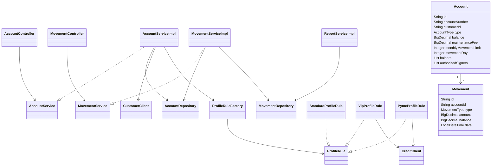
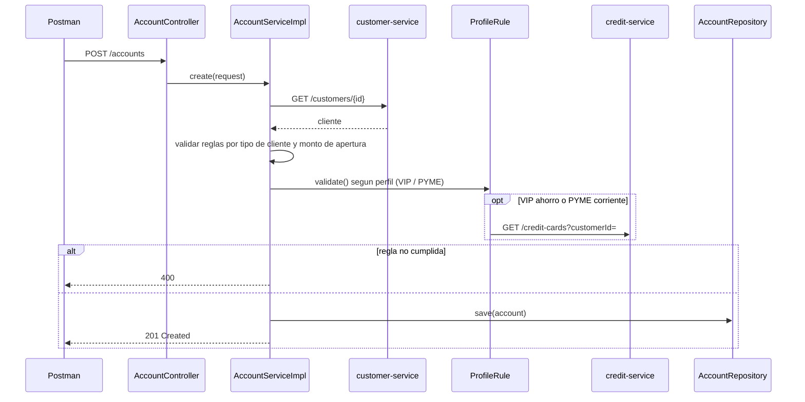
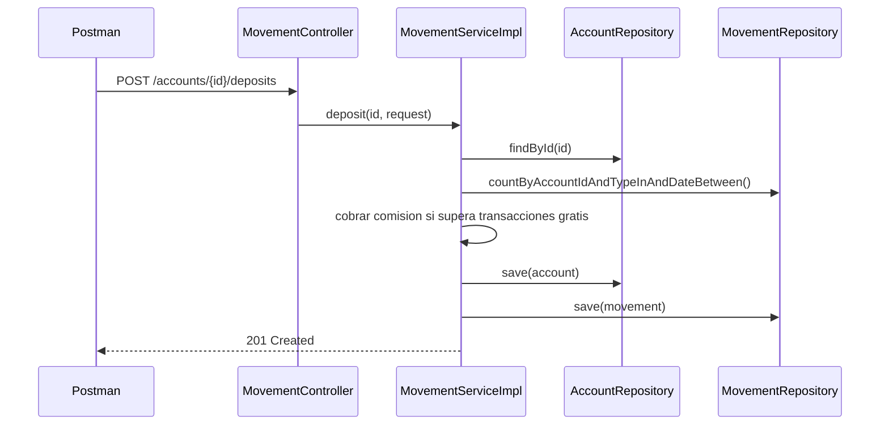
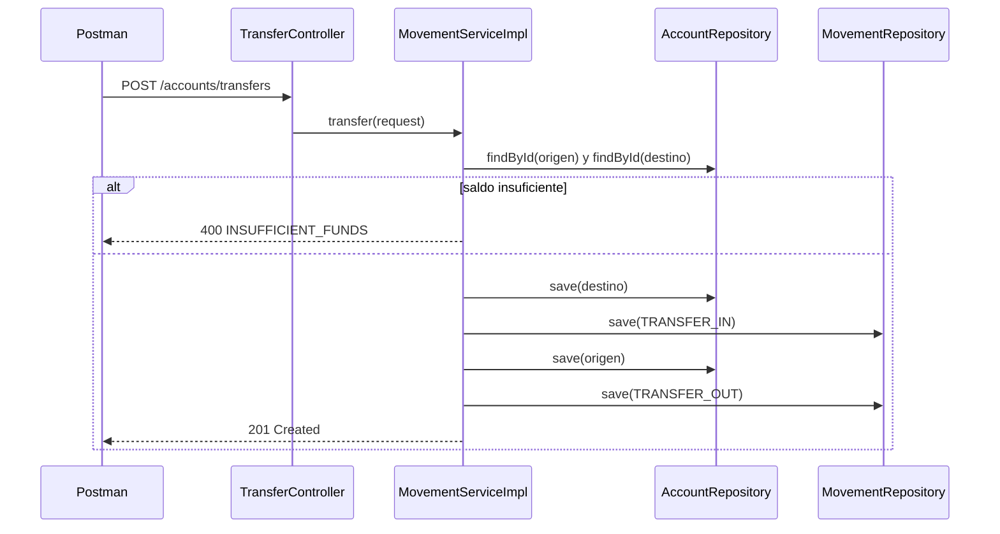
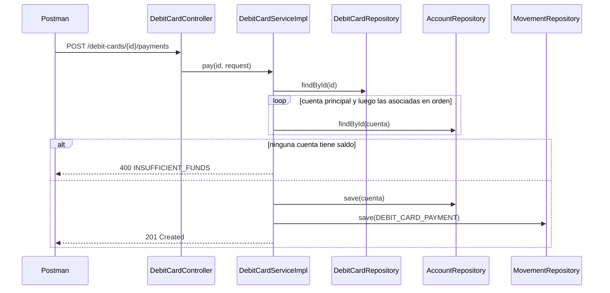
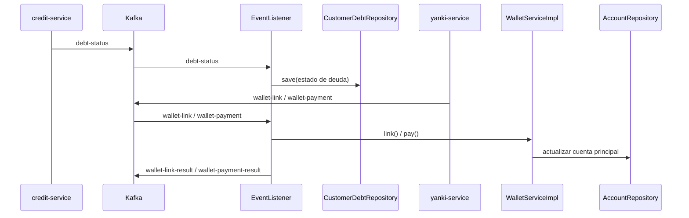

# Diagramas

## Clases

```mermaid
classDiagram
  AccountController --> AccountService
  MovementController --> MovementService
  AccountServiceImpl ..|> AccountService
  MovementServiceImpl ..|> MovementService
  AccountServiceImpl --> AccountRepository
  AccountServiceImpl --> CustomerClient
  MovementServiceImpl --> AccountRepository
  MovementServiceImpl --> MovementRepository
  AccountServiceImpl --> ProfileRuleFactory
  ProfileRuleFactory --> ProfileRule
  StandardProfileRule ..|> ProfileRule
  VipProfileRule ..|> ProfileRule
  PymeProfileRule ..|> ProfileRule
  VipProfileRule --> CreditClient
  PymeProfileRule --> CreditClient
  ReportServiceImpl --> MovementRepository
  Account "1" --> "*" Movement
  class Account {
    String id
    String accountNumber
    String customerId
    AccountType type
    BigDecimal balance
    BigDecimal maintenanceFee
    Integer monthlyMovementLimit
    Integer movementDay
    List holders
    List authorizedSigners
  }
  class Movement {
    String id
    String accountId
    MovementType type
    BigDecimal amount
    BigDecimal balance
    LocalDateTime date
  }
```

## Secuencia: crear cuenta

```mermaid
sequenceDiagram
  Postman->>AccountController: POST /accounts
  AccountController->>AccountServiceImpl: create(request)
  AccountServiceImpl->>customer-service: GET /customers/{id}
  customer-service-->>AccountServiceImpl: cliente
  AccountServiceImpl->>AccountServiceImpl: validar reglas por tipo de cliente y monto de apertura
  AccountServiceImpl->>ProfileRule: validate() segun perfil (VIP / PYME)
  opt VIP ahorro o PYME corriente
    ProfileRule->>credit-service: GET /credit-cards?customerId=
  end
  alt regla no cumplida
    AccountServiceImpl-->>Postman: 400
  else
    AccountServiceImpl->>AccountRepository: save(account)
    AccountServiceImpl-->>Postman: 201 Created
  end
```

## Secuencia: depósito / retiro

```mermaid
sequenceDiagram
  Postman->>MovementController: POST /accounts/{id}/deposits
  MovementController->>MovementServiceImpl: deposit(id, request)
  MovementServiceImpl->>AccountRepository: findById(id)
  MovementServiceImpl->>MovementRepository: countByAccountIdAndTypeInAndDateBetween()
  MovementServiceImpl->>MovementServiceImpl: cobrar comision si supera transacciones gratis
  MovementServiceImpl->>AccountRepository: save(account)
  MovementServiceImpl->>MovementRepository: save(movement)
  MovementServiceImpl-->>Postman: 201 Created
```

## Secuencia: transferencia

```mermaid
sequenceDiagram
  Postman->>TransferController: POST /accounts/transfers
  TransferController->>MovementServiceImpl: transfer(request)
  MovementServiceImpl->>AccountRepository: findById(origen) y findById(destino)
  alt saldo insuficiente
    MovementServiceImpl-->>Postman: 400 INSUFFICIENT_FUNDS
  else
    MovementServiceImpl->>AccountRepository: save(destino)
    MovementServiceImpl->>MovementRepository: save(TRANSFER_IN)
    MovementServiceImpl->>AccountRepository: save(origen)
    MovementServiceImpl->>MovementRepository: save(TRANSFER_OUT)
    MovementServiceImpl-->>Postman: 201 Created
  end
```

## Secuencia: pago con tarjeta de débito

```mermaid
sequenceDiagram
  Postman->>DebitCardController: POST /debit-cards/{id}/payments
  DebitCardController->>DebitCardServiceImpl: pay(id, request)
  DebitCardServiceImpl->>DebitCardRepository: findById(id)
  loop cuenta principal y luego las asociadas en orden
    DebitCardServiceImpl->>AccountRepository: findById(cuenta)
  end
  alt ninguna cuenta tiene saldo
    DebitCardServiceImpl-->>Postman: 400 INSUFFICIENT_FUNDS
  else
    DebitCardServiceImpl->>AccountRepository: save(cuenta)
    DebitCardServiceImpl->>MovementRepository: save(DEBIT_CARD_PAYMENT)
    DebitCardServiceImpl-->>Postman: 201 Created
  end
```

## Secuencia: eventos de Kafka

```mermaid
sequenceDiagram
  credit-service->>Kafka: debt-status
  Kafka->>EventListener: debt-status
  EventListener->>CustomerDebtRepository: save(estado de deuda)
  yanki-service->>Kafka: wallet-link / wallet-payment
  Kafka->>EventListener: wallet-link / wallet-payment
  EventListener->>WalletServiceImpl: link() / pay()
  WalletServiceImpl->>AccountRepository: actualizar cuenta principal
  EventListener->>Kafka: wallet-link-result / wallet-payment-result
```
