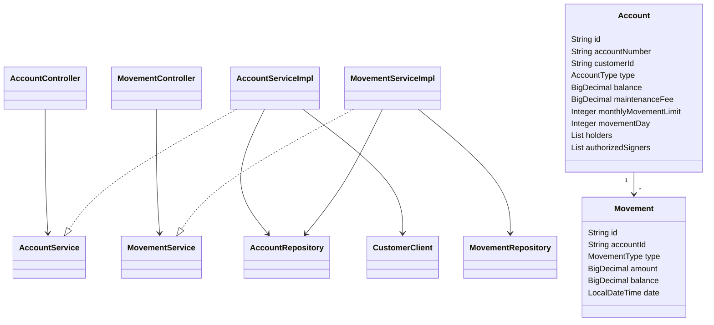
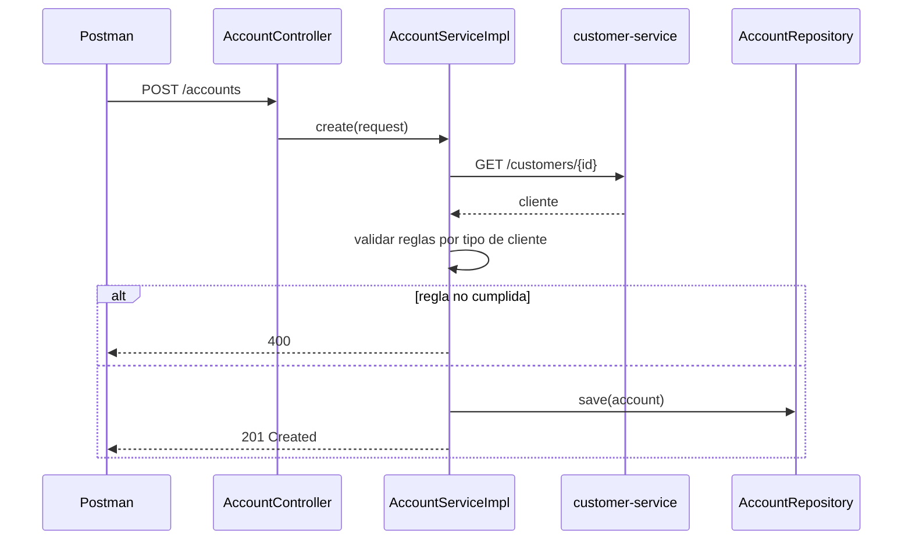
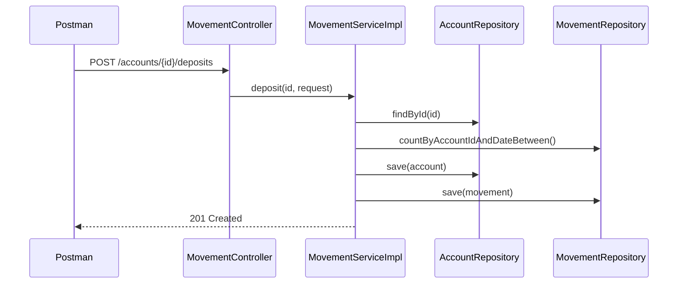

# Diagramas

## Clases

```mermaid
classDiagram
  AccountController --> AccountService
  MovementController --> MovementService
  AccountServiceImpl ..|> AccountService
  MovementServiceImpl ..|> MovementService
  AccountServiceImpl --> AccountRepository
  AccountServiceImpl --> CustomerClient
  MovementServiceImpl --> AccountRepository
  MovementServiceImpl --> MovementRepository
  Account "1" --> "*" Movement
  class Account {
    String id
    String accountNumber
    String customerId
    AccountType type
    BigDecimal balance
    BigDecimal maintenanceFee
    Integer monthlyMovementLimit
    Integer movementDay
    List holders
    List authorizedSigners
  }
  class Movement {
    String id
    String accountId
    MovementType type
    BigDecimal amount
    BigDecimal balance
    LocalDateTime date
  }
```

## Secuencia: crear cuenta

```mermaid
sequenceDiagram
  Postman->>AccountController: POST /accounts
  AccountController->>AccountServiceImpl: create(request)
  AccountServiceImpl->>customer-service: GET /customers/{id}
  customer-service-->>AccountServiceImpl: cliente
  AccountServiceImpl->>AccountServiceImpl: validar reglas por tipo de cliente
  alt regla no cumplida
    AccountServiceImpl-->>Postman: 400
  else
    AccountServiceImpl->>AccountRepository: save(account)
    AccountServiceImpl-->>Postman: 201 Created
  end
```

## Secuencia: depósito / retiro

```mermaid
sequenceDiagram
  Postman->>MovementController: POST /accounts/{id}/deposits
  MovementController->>MovementServiceImpl: deposit(id, request)
  MovementServiceImpl->>AccountRepository: findById(id)
  MovementServiceImpl->>MovementRepository: countByAccountIdAndDateBetween()
  MovementServiceImpl->>AccountRepository: save(account)
  MovementServiceImpl->>MovementRepository: save(movement)
  MovementServiceImpl-->>Postman: 201 Created
```
